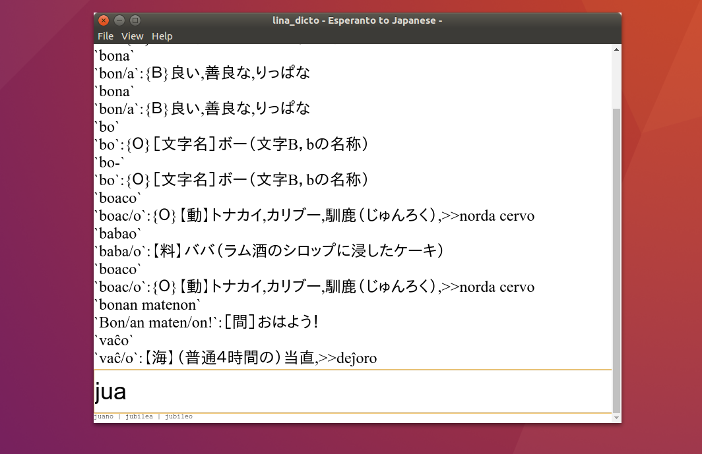

lina\_dicto
====
\- Dictionary for Japanese to Esperanto -

# About
lina\_dicto は日本語からEsperantoへ変換する単語辞書アプリケーションです。  

# Screenshot/Image
  

# Project goal
見た目がよいクロスプラットフォームな日本語/Esperanto変換辞書アプリケーションを提供する。  

# 辞書データについて
外部の辞書データを改変し収録させて頂きました。感謝いたします。  
[data/README.md](lina_dicto/data/README.md)参照  

# Get lina\_dicto
get source:  
`git clone https://github.com/MichianriNukazawa/lina_dicto`  

[Download for windows(v0.1.0)](https://github.com/MichinariNukazawa/lina_dicto/releases/download/v0.1.0/lina_dicto-win64-0.1.0-238d1d9.zip)  

# Donate/Buy
@todo  
Online store [project daisy bell][pixiv_booth_project_daisy_bell] and [RuneAMN fonts Pro][gumroad_runeamn_fonts_pro] is product by daisy bell.  
And please contact.  

# Environment
Linux. (Ubuntu 16.04LTS+), Windows. (64bit)  

## Build
```
cd lina_dict/lina_dict/
npm run build
```

## Develop
Depend: nodejs, electron and other npm packages.  

# Specification

## Already implement
- 単語検索
- インクリメンタルサーチ(検索候補表示)
- 代用表現変換表示(^-system)
- 簡易検索履歴

## Todo
- デフォルト設定スキンのデザイン
- ユーザー設定スキン(ユーザ設定フォント)
- 検索履歴の保持

## Long Todo
やるかどうかわからないものたち  
- 和エス辞書
- 語根表示(接頭辞・接尾辞解析)
- 語根推定検索
- 辞書編集機能(項目追加等)
- 辞書選択機能(辞書追加)
- 多代用表記対応

## License
Clause-2 BSD License  
Exclude dictionary data.(辞書ファイルは辞書ファイル毎のライセンスに準じます)  

# Contact
mail: [michinari.nukazawa@gmail.com][mailto]  
twitter: [@MNukazawa][twitter]  

Develop by Michinari.Nukazawa, in project "daisy bell".  

[pixiv_booth_project_daisy_bell]: https://daisy-bell.booth.pm/
[gumroad_runeamn_fonts_pro]: https://gumroad.com/l/UNWF
[mailto]: mailto:michinari.nukazawa@gmail.com
[twitter]: https://twitter.com/MNukazawa

