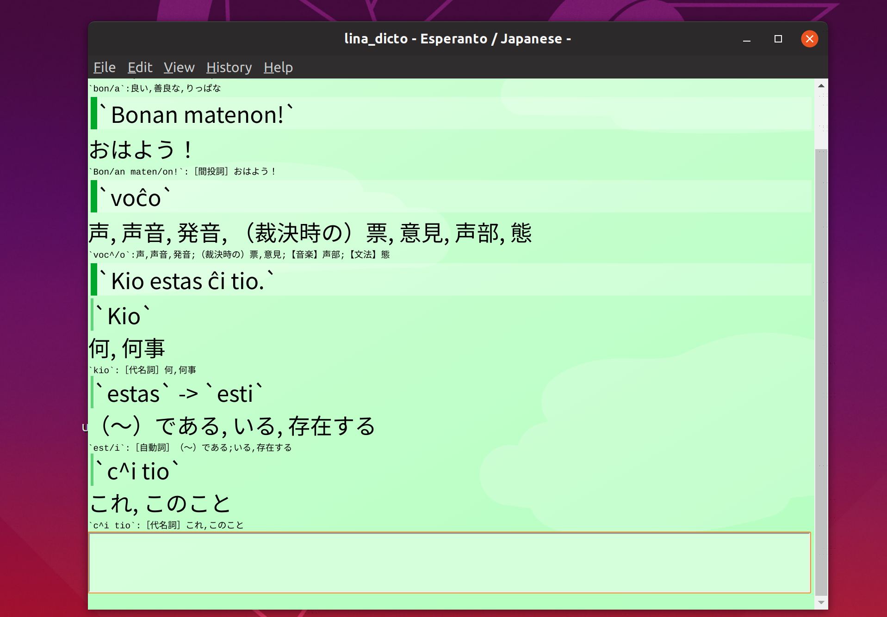
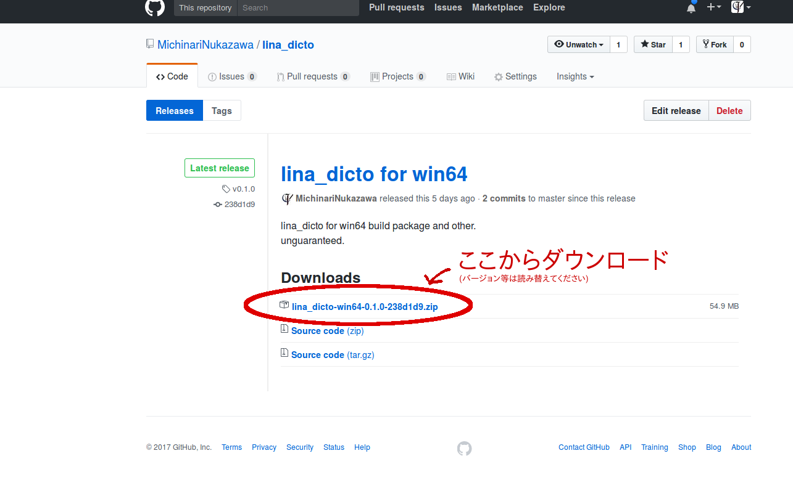

lina\_dicto
====
[](https://travis-ci.org/MichinariNukazawa/lina_dicto)  

\- Dictionary for Japanese to Esperanto -

# About
lina\_dicto は日本語/Esperanto変換を検索できる辞書アプリケーションです。  

Win/Mac/Linux対応。  
[Android版(for Android)]( https://play.google.com/store/apps/details?id=com.michinari_nukazawa.app.lina_dicto_for_android )  

  

## アプリケーションの特徴
- アプリケーション画面上で過去の検索結果が簡単に確認できる、タイムライン風のUI
- 和エス・エス和辞書検索を補助する複数の機能を搭載
  - 入力中に単語の候補を表示する「インクリメンタルサーチ」
  - 語根変換ルールに基づいて品詞語根を置き換えて検索結果を探す「語根マッチ」
  - スペルミスに対してエスペラント単語の候補を自動で推定する「もしかして機能」
  - エスペラント・日本語の文章を入れると、自動で単語ごとに分割して検索してくれる「文章検索」
  - 和エス検索でヒットしなかった際に、入力と部分一致する日本語の単語を候補として示す「候補推定」
  - インクリメンタルサーチ・もしかして機能などによる候補を、クリック一発で入力できる「入力補助リンクボタン」
  - 検索がヒットしなかった場合に、ブラウザでgoogle translateを開くリンクを提示する「フォールバック機能」
  - 数値を入れるとエスペラント文字表現に変換する「数字変換」(ex."104" -> "cent kvar")
  - ひらがな・カタカナ読みを入力するとスペルを推定して近い単語を示す「読みがな検索」
- 複数のエスペラント代用表記に対応(^-sistemo x-sistemo alfabeto)
- 検索履歴
  - 検索履歴をファイルへ自動保存(簡易統計機能あり)
- ユリアーモ( http://sukerasparo.com/sp004/font.html )対応辞書として使える機能
  - ユリアーモ割り当て文字列での検索に対応「ユリアーモ割り当て入力」
  - ユリアーモ割り当てへの変換および表示を行う「ユリアーモ割り当て出力」
  - 表示フォントをユーザ設定できる「Webフォント表示」(フォントファイルも対応) 
- カスタムスキン「User CSS」

# Download
[Download for latest release](https://github.com/MichinariNukazawa/lina_dicto/releases)  

  

# 辞書データについて
外部の辞書データを改変し収録させて頂きました。感謝いたします。  
[辞書データのREADME](lina_dicto/dictionary/README.md)参照  

# Donate/Buy
@todo  
Online store [project daisy bell][pixiv_booth_project_daisy_bell] and [RuneAMN fonts Pro][gumroad_runeamn_fonts_pro] is product by daisy bell.  
And please contact.  

# Other variation
[lina\_dicto for android](https://github.com/MichinariNukazawa/lina_dicto_for_android)  
[lina\_dicto for ios](https://github.com/MichinariNukazawa/lina_dicto_for_ios)  
[lina\_dicto for webextension](https://github.com/MichinariNukazawa/lina_dicto_for_webextension)  
[lina\_dicto english](https://github.com/MichinariNukazawa/lina_dicto_english)  

# Develop
## Project goal
初学者に使いやすく、見た目がよい、クロスプラットフォームな日本語/Esperanto変換辞書アプリケーションを提供する。  

## Get lina\_dicto
get source:  
`git clone --depth=1 https://github.com/MichinariNukazawa/lina_dicto.git`  

## Environment
Linux. (Ubuntu 16.04LTS+), Windows. (64bit)  

## Build
setup:  
`sudo apt install npm -y`  
or  
`sudo bash setup/library_for_ubuntu.sh`  

setup pre-commit hook for developer.  
`bash setup/setup.sh`  

```
cd lina_dicto/
npm install
```

## Run
`make run`  

## Test
`make test`  

### Package
Win64, MacOSX, Linux(deb).  
`make package`  

## Depend
nodejs, electron and other npm packages.  

## License
Clause-2 BSD License  
Exclude dictionary data.(辞書ファイルは辞書ファイル毎のライセンスに準じます)  

# Contact
mail: [michinari.nukazawa@gmail.com][mailto]  
twitter: [@MNukazawa][twitter]  

Develop by Michinari.Nukazawa, in project "daisy bell".  

[pixiv_booth_project_daisy_bell]: https://daisy-bell.booth.pm/
[gumroad_runeamn_fonts_pro]: https://gumroad.com/l/UNWF
[mailto]: mailto:michinari.nukazawa@gmail.com
[twitter]: https://twitter.com/MNukazawa

